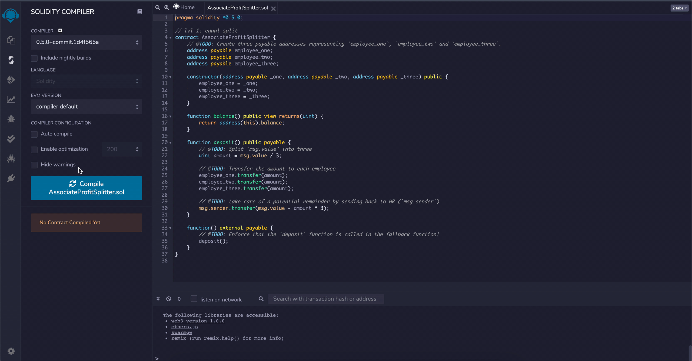
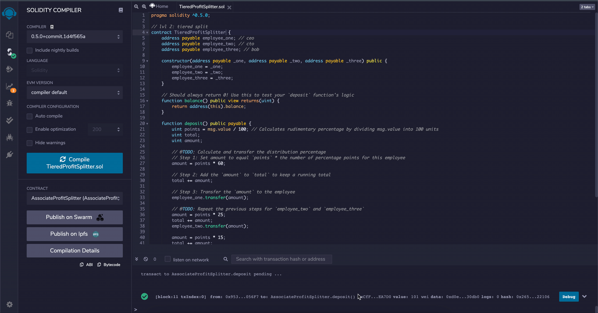

# First Contract in Solidity

## Files

* [AssociateProfitSplitter.sol](Code/AssociateProfitSplitter.sol) -- [Level 1](#Level-One-`AssociateProfitSplitter.sol`-Contract)
* [TieredProfitSplitter.sol](Code/TieredProfitSplitter.sol) -- [Level 2](#Level-Two-`TieredProfitSplitter.sol`-Contract)
* [DeferredEquityPlan.sol](Code/DeferredEquityPlan.sol) -- [Level 3](#Level-Three-`DeferredEquityPlan.sol`-Contract)

---

### To Note

* Before developing and testing the contracts, I have my blockchain network running in [Ganache](https://www.trufflesuite.com/ganache) and MetaMask extension connected and pointing to `Localhost:8545`.

* In the `Deploy` tab in [Remix IDE](http://remix.ethereum.org), I connected to my local Ganache chain by selecting `Injected Web3` in the `Environment` column.

* For each contract, I filled in the constructor parameters with the designated employee addresses before transacting and deploying.

---

### Level One: `AssociateProfitSplitter.sol` Contract

This contract accepts Ether and divides it evenly between Associate-level employees. This allows the Human Resources department to pay employees quickly and efficiently.

#### Compile `AssociateProfitSplitter.sol`



#### Deploy `AssociateProfitSplitter.sol`


### Level Two: `TieredProfitSplitter.sol` Contract

In this contract rudimentary percentages are calculated for different tiers of employees (CEO, CTO, and Bob). The incoming Ether is distributed at different levels: CEO – 60%; CTO – 25%; Bob – 15%.

#### Compile `TieredProfitSplitter.sol`



#### Deploy `TieredProfitSplitter.sol`


### Level Three: `DeferredEquityPlan.sol` Contract

In This contract 1000 shares are automatically distributed over 4 years to the employee, deployed by HR.

#### Compile and Deploy `DeferredEquityPlan.sol`

For testing purposes, I created a new variable `uint fakenow = now;` and utilized the function to fast forward by 100 days:

 ```solidity
    function fastforward() public {
        fakenow += 100 days;
    }
```


